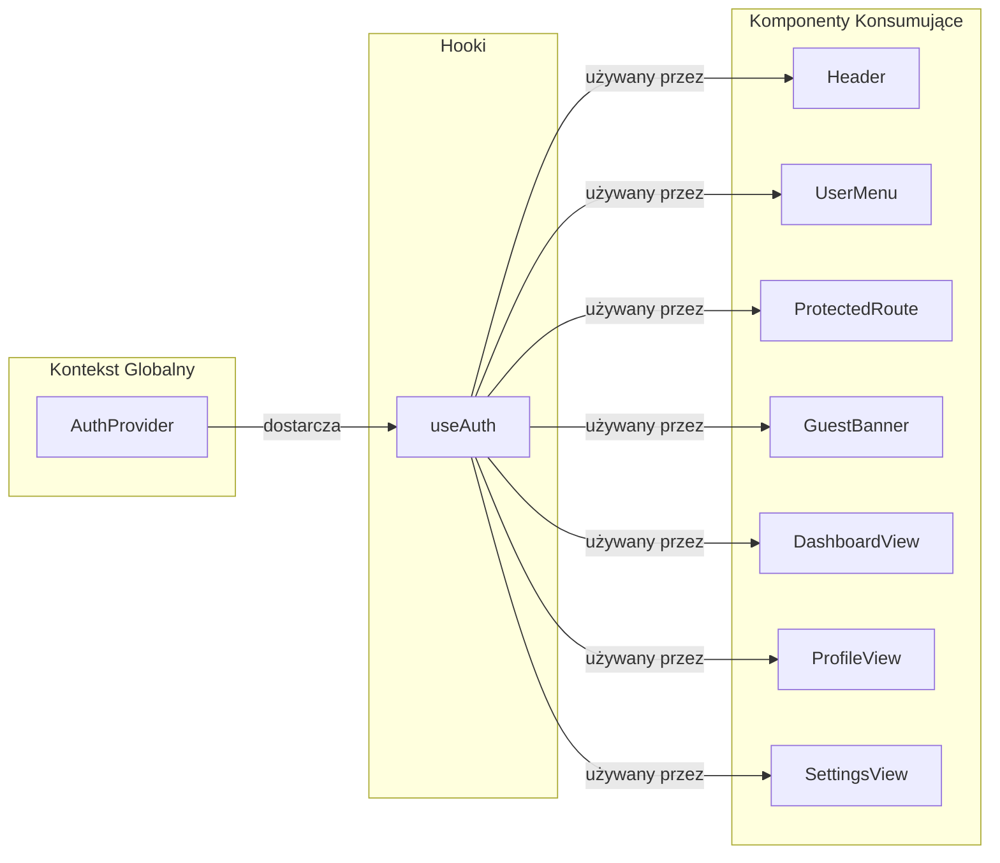

# Diagram Architektury UI - Moduł Autentykacji FretNinja

## Analiza Architektury

<architecture_analysis>

### 1. Komponenty wymienione w dokumentacji

**Strony Astro (istniejące):**
- `/pages/index.astro` - Strona główna (landing page)
- `/pages/login.astro` - Strona logowania
- `/pages/register.astro` - Strona rejestracji
- `/pages/reset-password.astro` - Strona resetowania hasła
- `/pages/auth/password-update.astro` - Strona aktualizacji hasła
- `/pages/dashboard.astro` - Panel użytkownika
- `/pages/profile.astro` - Profil użytkownika
- `/pages/settings.astro` - Ustawienia

**Strony Astro (do utworzenia):**
- `/pages/auth/callback.astro` - Obsługa callbacków (potwierdzenie email)
- `/pages/achievements.astro` - Osiągnięcia użytkownika
- `/pages/statistics.astro` - Statystyki użytkownika

**Komponenty React Auth (istniejące):**
- `LoginForm.tsx` - Formularz logowania
- `RegisterForm.tsx` - Formularz rejestracji
- `PasswordResetForm.tsx` - Formularz resetowania hasła

**Komponenty React Auth (do utworzenia):**
- `AuthProvider.tsx` - Globalny kontekst autentykacji
- `ProtectedRoute.tsx` - Wrapper ochrony tras
- `GuestBanner.tsx` - Baner dla użytkowników gości

**Komponenty Nawigacji (do utworzenia):**
- `Header.tsx` - Nagłówek z menu
- `UserMenu.tsx` - Menu użytkownika (dropdown)
- `MobileNav.tsx` - Nawigacja mobilna
- `NavLink.tsx` - Link nawigacyjny

**Layouty (istniejące):**
- `Layout.astro` - Bazowy layout

**Layouty (do utworzenia):**
- `AppLayout.astro` - Layout dla stron autentykowanych
- `AuthLayout.astro` - Layout dla stron autentykacji

### 2. Główne strony i odpowiadające komponenty

| Strona | Typ dostępu | Główny komponent | Layout |
|--------|-------------|------------------|--------|
| Landing (`/`) | Publiczny | CTA buttons | Layout |
| Login (`/login`) | Publiczny | LoginForm | AuthLayout |
| Register (`/register`) | Publiczny | RegisterForm | AuthLayout |
| Reset Password (`/reset-password`) | Publiczny | PasswordResetForm | AuthLayout |
| Password Update (`/auth/password-update`) | Publiczny | PasswordResetForm | AuthLayout |
| Auth Callback (`/auth/callback`) | Publiczny | - | Layout |
| Dashboard (`/dashboard`) | Chroniony | DashboardView | AppLayout |
| Profile (`/profile`) | Chroniony | ProfileView | AppLayout |
| Settings (`/settings`) | Chroniony | SettingsView | AppLayout |
| Achievements (`/achievements`) | Chroniony | AchievementsView | AppLayout |
| Statistics (`/statistics`) | Chroniony | StatisticsView | AppLayout |
| Quiz (`/quiz/*`) | Mieszany | QuizComponent | AppLayout |
| Explorer (`/explorer`) | Mieszany | ExplorerView | AppLayout |

### 3. Przepływ danych między komponentami

1. **Autentykacja:**
   - `LoginForm` → API `/api/auth/login` → localStorage (tokeny) → `AuthProvider`
   - `RegisterForm` → API `/api/auth/register` → localStorage (tokeny) → `AuthProvider`
   - `PasswordResetForm` → API `/api/auth/password-reset` lub `/api/auth/password-update`

2. **Zarządzanie stanem:**
   - `AuthProvider` dostarcza kontekst do wszystkich komponentów
   - `useAuth()` hook używany w komponentach do odczytu stanu
   - localStorage przechowuje: `fn_access_token`, `fn_refresh_token`, `fn_token_expiry`

3. **Ochrona tras:**
   - Middleware sprawdza tokeny dla chronionych tras
   - `ProtectedRoute` wrapper dla komponentów client-side

4. **Tryb gościa:**
   - Brak tokena = `isGuest: true` w AuthProvider
   - `GuestBanner` wyświetlany na stronach quiz/explorer

### 4. Opis funkcjonalności komponentów

**AuthProvider:** Globalny stan autentykacji, metody login/logout/refresh, hydratacja z localStorage

**LoginForm:** Walidacja email/hasło, obsługa błędów API, zapis tokenów, przekierowanie do dashboard

**RegisterForm:** Walidacja z wskaźnikiem siły hasła, rejestracja, auto-login po sukcesie

**PasswordResetForm:** Dwuetapowy formularz (żądanie resetu / aktualizacja hasła z tokenem)

**Header:** Nawigacja główna, renderowanie warunkowe dla stanów auth/guest

**UserMenu:** Dropdown z opcjami profilu, osiągnięć, ustawień, wylogowania

**GuestBanner:** Informacja o braku zapisu postępów, CTA do rejestracji

**ProtectedRoute:** Wrapper sprawdzający auth przed renderowaniem zawartości

</architecture_analysis>

## Diagram Mermaid

```mermaid
flowchart TD
    subgraph "Warstwa Layoutów"
        L1["Layout.astro<br/>(Bazowy)"]
        L2["AuthLayout.astro<br/>(Strony auth)"]:::new
        L3["AppLayout.astro<br/>(Strony aplikacji)"]:::new

        L1 --> L2
        L1 --> L3
    end

    subgraph "Strony Publiczne"
        P1["index.astro<br/>(Landing)"]:::updated
        P2["login.astro"]
        P3["register.astro"]
        P4["reset-password.astro"]
        P5["auth/password-update.astro"]
        P6["auth/callback.astro"]:::new
    end

    subgraph "Strony Chronione"
        S1["dashboard.astro"]:::updated
        S2["profile.astro"]:::updated
        S3["settings.astro"]:::updated
        S4["achievements.astro"]:::new
        S5["statistics.astro"]:::new
    end

    subgraph "Strony Mieszane"
        M1["quiz/index.astro"]:::updated
        M2["explorer.astro"]:::updated
    end

    subgraph "Komponenty Autentykacji"
        A1["AuthProvider.tsx"]:::new
        A2["LoginForm.tsx"]:::updated
        A3["RegisterForm.tsx"]:::updated
        A4["PasswordResetForm.tsx"]
        A5["ProtectedRoute.tsx"]:::new
        A6["GuestBanner.tsx"]:::new
    end

    subgraph "Komponenty Nawigacji"
        N1["Header.tsx"]:::new
        N2["UserMenu.tsx"]:::new
        N3["MobileNav.tsx"]:::new
        N4["NavLink.tsx"]:::new
    end

    subgraph "Zarządzanie Stanem"
        ST1[("localStorage<br/>fn_access_token")]
        ST2[("localStorage<br/>fn_refresh_token")]
        ST3["useAuth Hook"]:::new
    end

    subgraph "API Autentykacji"
        API1["/api/auth/login"]
        API2["/api/auth/register"]
        API3["/api/auth/logout"]
        API4["/api/auth/password-reset"]
        API5["/api/auth/password-update"]
        API6["/api/auth/refresh"]:::new
        API7["/api/auth/session"]:::new
    end

    subgraph "Middleware"
        MW1["middleware/index.ts"]:::updated
    end

    %% Połączenia Layoutów
    L2 --> P2
    L2 --> P3
    L2 --> P4
    L2 --> P5
    L3 --> S1
    L3 --> S2
    L3 --> S3
    L3 --> S4
    L3 --> S5
    L3 --> M1
    L3 --> M2
    L1 --> P1
    L1 --> P6

    %% Połączenia Komponentów Auth
    P2 --"renderuje"--> A2
    P3 --"renderuje"--> A3
    P4 --"renderuje"--> A4
    P5 --"renderuje"--> A4

    %% Połączenia Nawigacji
    L3 --"zawiera"--> N1
    N1 --"zawiera"--> N2
    N1 --"zawiera"--> N3
    N1 --"używa"--> N4

    %% Połączenia Stanu
    A1 --"dostarcza kontekst"--> ST3
    ST3 --"odczytuje"--> ST1
    ST3 --"odczytuje"--> ST2
    A2 --"zapisuje tokeny"--> ST1
    A3 --"zapisuje tokeny"--> ST1
    N2 --"używa"--> ST3
    A5 --"używa"--> ST3
    A6 --"używa"--> ST3

    %% Połączenia API
    A2 --"POST"--> API1
    A3 --"POST"--> API2
    N2 --"POST"--> API3
    A4 --"POST"--> API4
    A4 --"POST"--> API5
    A1 --"POST"--> API6
    A1 --"GET"--> API7

    %% Połączenia Middleware
    MW1 --"chroni"--> S1
    MW1 --"chroni"--> S2
    MW1 --"chroni"--> S3
    MW1 --"chroni"--> S4
    MW1 --"chroni"--> S5

    %% Połączenia Trybu Gościa
    M1 --"wyświetla dla gości"--> A6
    M2 --"wyświetla dla gości"--> A6

    %% Przepływy Użytkownika
    P1 --"Zaloguj się"--> P2
    P1 --"Zarejestruj się"--> P3
    P1 --"Tryb gościa"--> S1
    P2 --"Nie masz konta?"--> P3
    P2 --"Zapomniałeś hasła?"--> P4
    P3 --"Masz konto?"--> P2
    A2 --"sukces"--> S1
    A3 --"sukces"--> S1
    N2 --"wyloguj"--> P1

    %% Style
    classDef new fill:#22c55e,stroke:#16a34a,color:#fff
    classDef updated fill:#3b82f6,stroke:#2563eb,color:#fff
    classDef default fill:#334155,stroke:#475569,color:#fff
```

<mermaid_diagram>



</mermaid_diagram>

## Legenda

| Kolor | Znaczenie |
|-------|-----------|
| 🟢 Zielony | Nowe komponenty do utworzenia |
| 🔵 Niebieski | Istniejące komponenty wymagające aktualizacji |
| ⬛ Szary | Istniejące komponenty bez zmian |

## Kluczowe przepływy

### 1. Przepływ rejestracji (US-001)
```
Landing → Register → RegisterForm → API /register → localStorage → Dashboard
```

### 2. Przepływ logowania (US-002)
```
Landing → Login → LoginForm → API /login → localStorage → Dashboard
```

### 3. Przepływ wylogowania (US-003)
```
UserMenu → API /logout → Clear localStorage → Landing
```

### 4. Przepływ resetowania hasła (US-004)
```
Login → Reset Password → PasswordResetForm → API /password-reset → Email → Password Update → API /password-update → Login
```

### 5. Przepływ trybu gościa (US-005)
```
Landing → Dashboard (Guest) → Quiz/Explorer + GuestBanner → Register Prompt
```

## Zależności między komponentami



## Struktura plików do utworzenia/aktualizacji

```
src/
├── components/
│   ├── auth/
│   │   ├── AuthProvider.tsx        ← NOWY
│   │   ├── ProtectedRoute.tsx      ← NOWY
│   │   ├── GuestBanner.tsx         ← NOWY
│   │   ├── LoginForm.tsx           ← AKTUALIZACJA (linki nawigacyjne)
│   │   └── RegisterForm.tsx        ← AKTUALIZACJA (link do logowania)
│   ├── hooks/
│   │   └── useAuth.ts              ← NOWY
│   └── navigation/
│       ├── Header.tsx              ← NOWY
│       ├── UserMenu.tsx            ← NOWY
│       ├── MobileNav.tsx           ← NOWY
│       └── NavLink.tsx             ← NOWY
├── layouts/
│   ├── Layout.astro                (bez zmian)
│   ├── AppLayout.astro             ← NOWY
│   └── AuthLayout.astro            ← NOWY
├── middleware/
│   └── index.ts                    ← AKTUALIZACJA (ochrona tras)
└── pages/
    ├── index.astro                 ← AKTUALIZACJA (CTA trybu gościa)
    ├── auth/
    │   └── callback.astro          ← NOWY
    ├── achievements.astro          ← NOWY
    ├── statistics.astro            ← NOWY
    ├── dashboard.astro             ← AKTUALIZACJA (integracja z auth)
    ├── profile.astro               ← AKTUALIZACJA (integracja z auth)
    ├── settings.astro              ← AKTUALIZACJA (integracja z auth)
    ├── quiz/
    │   └── [mode].astro            ← AKTUALIZACJA (GuestBanner)
    └── explorer.astro              ← AKTUALIZACJA (GuestBanner)
```
